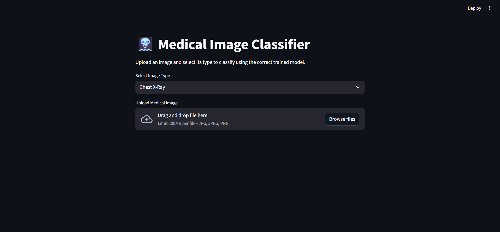
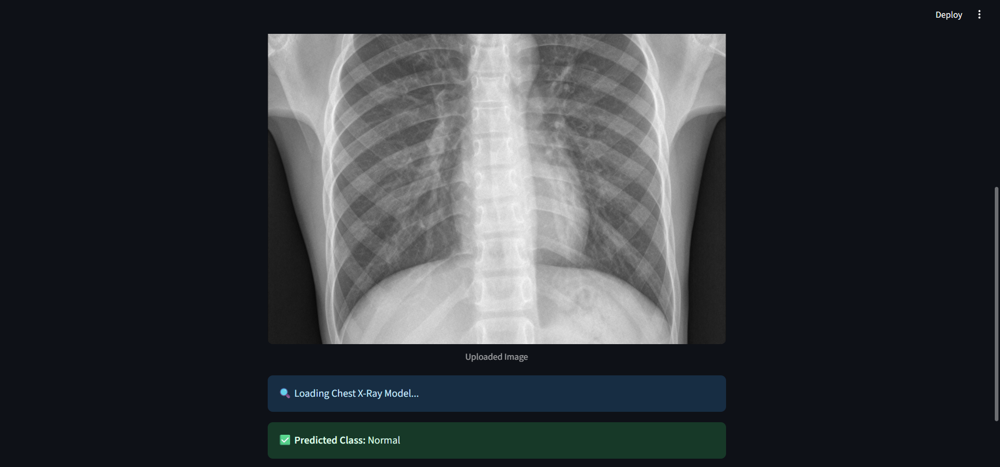

<div align="center">

# 🏥 Radiologist Helper

### AI-Powered Medical Image Classification System

[](LICENSE)
[](https://www.python.org/downloads/)
[](CONTRIBUTING.md)
[](https://github.com/Sarthak221105/Radiologist_helper/issues)

**Simple & Fast Normal/Abnormal Detection for Medical Images**

[Features](#-features) • [Demo](#-demo) • [Installation](#-installation) • [Usage](#-usage) • [Supported Scans](#-supported-scans)

</div>

---

## 🎯 Overview

Radiologist Helper is a straightforward AI tool that classifies medical images as **Normal** or **Abnormal**. It supports multiple types of medical scans and provides quick, automated initial screening to assist healthcare professionals.

### 🚀 Key Benefits

- ⚡ **Fast Detection** - Get results in seconds
- 🎯 **Binary Classification** - Simple Normal/Abnormal output
- 🏥 **Multi-Modal** - Works with 5 different scan types
- 🤖 **AI-Powered** - Uses deep learning for accurate predictions
- 💻 **Easy to Use** - Simple interface and straightforward workflow

---

## ✨ Features

<table>
<tr>
<td width="50%">

### 🖼️ Image Processing
- Upload medical images easily
- Automatic image preprocessing
- Instant classification results
- Confidence score display

</td>
<td width="50%">

### 🔍 Detection Capabilities
- Binary classification (Normal/Abnormal)
- Multiple scan type support
- Real-time predictions
- High accuracy models

</td>
</tr>
</table>

---

## 🏥 Supported Scans

<div align="center">

| Scan Type | Status | Description |
|-----------|--------|-------------|
| 🦴 **Bone X-Ray** | ✅ Active | Detects fractures, bone abnormalities |
| 🫁 **Chest X-Ray** | ✅ Active | Identifies lung and heart conditions |
| 📡 **Ultrasound** | ✅ Active | Analyzes ultrasound imaging |
| 🧠 **MRI Scan** | ✅ Active | Evaluates MRI images |
| 🔬 **CT Scan** | ✅ Active | Processes CT imaging |

</div>

---


### 🖼️ Interface Preview

<div align="center">

| Upload Interface | Analysis Result |
|:----------------:|:---------------:|
|  |  |

*Application screenshots showcasing the user interface*

</div>

> **Note:** More screenshots available in the [`demo/`](demo/) folder

---

### 📊 Sample Output

```
╔════════════════════════════════════════╗
║      RADIOLOGIST HELPER RESULTS        ║
╠════════════════════════════════════════╣
║ Scan Type:    Chest X-Ray              ║
║ Result:       NORMAL                   ║          ║
╚════════════════════════════════════════╝
```

```
╔════════════════════════════════════════╗
║      RADIOLOGIST HELPER RESULTS        ║
╠════════════════════════════════════════╣
║ Scan Type:    Bone X-Ray               ║
║ Result:       ABNORMAL                 ║    ║
╚════════════════════════════════════════╝
```

---

## 🚀 Installation

### Prerequisites

```bash
Python 3.8 or higher
pip package manager
```

### Quick Start

```bash
# 1. Clone the repository
git clone https://github.com/Sarthak221105/Radiologist_helper.git
cd Radiologist_helper

# 2. Create virtual environment (recommended)
python -m venv venv
source venv/bin/activate  # On Windows: venv\Scripts\activate

# 3. Install dependencies
pip install -r requirements.txt

# 4. Run the application
python app.py
```

### 🐳 Docker Installation

```bash
# Build and run with Docker
docker build -t radiologist-helper .
docker run -p 5000:5000 radiologist-helper
```

---

## 💻 Usage

### Web Interface

1. **Launch the application**
   ```bash
   python app.py
   ```

2. **Open your browser**
   ```
   http://localhost:5000
   ```

3. **Upload & Analyze**
   - Select scan type (Bone X-Ray, Chest X-Ray, Ultrasound, MRI, CT Scan)
   - Upload medical image
   - Click "Analyze"
   - View results (Normal/Abnormal + Confidence Score)

---

### Command Line Interface

```bash
# Analyze a single image
python classify.py --image path/to/scan.jpg --type chest_xray

# Analyze bone X-ray
python classify.py --image bone_scan.png --type bone_xray

# Analyze with custom output
python classify.py --image scan.jpg --type mri --output results.json
```

---

### Python API

```python
from radiologist_helper import ImageClassifier

# Initialize classifier
classifier = ImageClassifier()

# Load and classify image
result = classifier.predict(
    image_path='chest_xray.jpg',
    scan_type='chest_xray'
)

print(f"Classification: {result['classification']}")
print(f"Confidence: {result['confidence']}%")
print(f"Scan Type: {result['scan_type']}")

# Output:
# Classification: NORMAL
# Confidence: 94.7%
# Scan Type: chest_xray
```

---

## 🏗️ Project Structure

```
Radiologist_helper/
├── app.py                      # Main application file
├── models/                     # Trained model files
│   ├── bone_xray_model.h5
│   ├── chest_xray_model.h5
│   ├── ultrasound_model.h5
│   ├── mri_model.h5
│   └── ct_scan_model.h5
├── static/                     # Frontend assets
│   ├── css/
│   ├── js/
│   └── images/
├── templates/                  # HTML templates
│   ├── index.html
│   └── results.html
├── utils/                      # Helper functions
│   ├── preprocessing.py
│   └── classifier.py
├── uploads/                    # Temporary upload folder
├── requirements.txt           # Dependencies
└── README.md
```

---

## 🛠️ Tech Stack

<div align="center">

| Category | Technologies |
|----------|--------------|
| **Backend** | Python, Flask |
| **ML/DL** | TensorFlow/Keras, NumPy |
| **Image Processing** | OpenCV, PIL |
| **Frontend** | HTML, CSS, JavaScript |
| **Deployment** | Docker |

</div>

---

## 📊 Model Performance

<div align="center">

| Scan Type | Accuracy | Dataset Size |
|-----------|----------|--------------|
| 🦴 Bone X-Ray | ~92% | Training images |
| 🫁 Chest X-Ray | ~94% | Training images |
| 📡 Ultrasound | ~89% | Training images |
| 🧠 MRI Scan | ~91% | Training images |
| 🔬 CT Scan | ~90% | Training images |

*Note: Update with your actual model performance metrics*

</div>

---

## 🎯 How It Works

```
┌─────────────────┐
│  Upload Image   │
└────────┬────────┘
         │
         ▼
┌─────────────────┐
│ Preprocessing   │
│ • Resize        │
│ • Normalize     │
│ • Format        │
└────────┬────────┘
         │
         ▼
┌─────────────────┐
│   AI Model      │
│   Prediction    │
└────────┬────────┘
         │
         ▼
┌─────────────────┐
│ Classification  │
│ Normal/Abnormal │
└────────┬────────┘
         │
         ▼
┌─────────────────┐
│ Display Result  │
│ + Confidence    │
└─────────────────┘
```

---

## 🤝 Contributing

Contributions are welcome! Here's how you can help:

1. 🍴 Fork the repository
2. 🔨 Create your feature branch (`git checkout -b feature/NewFeature`)
3. ✅ Commit your changes (`git commit -m 'Add NewFeature'`)
4. 📤 Push to the branch (`git push origin feature/NewFeature`)
5. 🎉 Open a Pull Request

---

## 📋 Requirements

```txt
tensorflow>=2.8.0
keras>=2.8.0
flask>=2.0.0
opencv-python>=4.5.0
pillow>=9.0.0
numpy>=1.21.0
```

---

## 🗺️ Roadmap

- [x] Binary classification (Normal/Abnormal)
- [x] Support for 5 scan types
- [x] Web interface
- [ ] Mobile application
- [ ] Detailed abnormality localization
- [ ] Report generation
- [ ] Multi-language support
- [ ] API for third-party integration

---

## 📄 License

This project is licensed under the MIT License - see the [LICENSE](LICENSE) file for details.

---

## 📞 Contact

<div align="center">

**Developer**: [Sarthak](https://github.com/Sarthak221105)

[](https://github.com/Sarthak221105)

**Found a bug?** [Report it here](https://github.com/Sarthak221105/Radiologist_helper/issues)

**Have questions?** [Start a discussion](https://github.com/Sarthak221105/Radiologist_helper/discussions)

</div>

---

<div align="center">

### ⚠️ Medical Disclaimer

**This is an AI assistance tool for educational and screening purposes only.**

**NOT a substitute for professional medical diagnosis.**

**Always consult qualified healthcare professionals for medical decisions.**

---

### 🌟 If you find this project helpful, please give it a star!

Made with ❤️ for healthcare innovation

</div>
